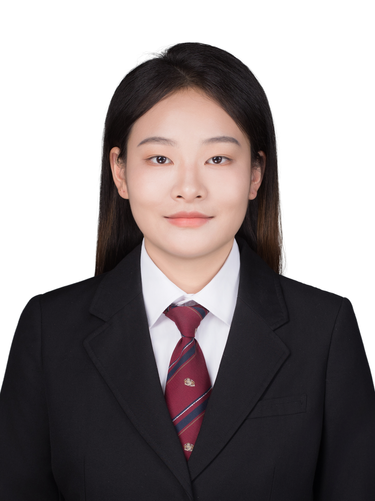

{width=200px}

About this site

# 教育经历
**华中农业大学 环境规划与管理 硕士  2025.9-至今**

*证书：*一等奖学金

*研究方向：*生态系统脆弱性、碳核算

**安徽农业大学 环境工程 学士  2021.9-2025.6**

GPA：3.99/5.0        专业排名：2/74

*证书：*专业奖学金（3次）、三好学生（2次）、优秀团员、CET-4、CET-6、生态环保大赛一等奖、三等奖

*主修课程：*环境监测、环境化学、大气污染控制工程、水污染控制工程、固体废物处理与处置、物理性污染控制工程、农业面源污染控制、土壤污染控制与修复等

# 在校经历

**专业学习委员	2021.10-2025.6**

负责管理专业的学习相关事务，与老师沟通作业与课程安排；解答同学在学习上的问题。

**学校实验室	2022.4-2023.10**

阅读土壤微生物相关文献、收集整理分析数据、进行Meta分析，使用origin画图；

进行生物碳吸附废水中四环素实验，寻找最佳吸附条件。

**办公室助理	2024.10-2025.4**

协助办公室老师工作、整理档案资料、核对各学期开课信息、学生退选课等。

**研会文体部 工作人员	2025.9-至今**

组织学院体育赛事

# 实习经历

**安徽省生态环境科学研究院 实习生	2024.5-2024.7**

取土样，进行称量、研磨、震荡等实验步骤；使用TOC分析仪测量安徽省土壤中TOC含量。

# 自我评价
我是积极向上、心态良好、踏实做事、抗压能力强的一个人。面对问题时会主动思考，积极沟通，寻找解决方法。在团队中能配合完成工作，具有团队合作精神。同时希望不断学习、提升自己。

# 联系方式
*邮箱：*1831652734@qq.com
*GitHub:*[JiangYee393](https://github.com/JiangYee393)
